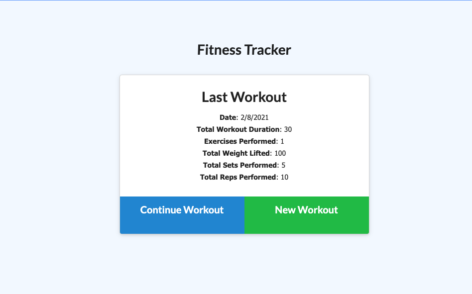
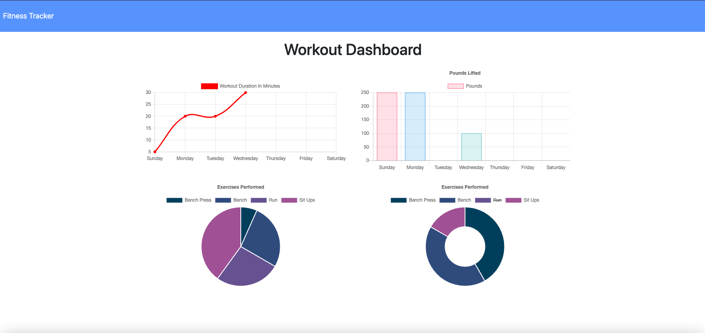

<h1 align="center">Nosql Homework: Workout Tracker</h1>

## Workout_Tracker

- [Description](#description)
- [Installation](#installation)
- [Usage](#usage)
- [Contributing](#contributing)
- [Questions](#questions)

## Description

This is a workout tracker application built using Mongo database schema and handle routes with Express.

The application allows a user to view, create and track daily workouts. The user is able to log multiple exercises in a workout on a given day and also able to track the name, type, weight, sets, reps, and duration of exercise.

The application was deployed with Heroku and MongoDB Atlas

Screenshot of the completed output:

## Installation

`npm init -y`

`npm i express`

`npm i morgan`

`npm i mongoose`

`npm i dotenv`

## Usage

Run the following command at the root of the directory and you will be able to view the local website at http://localhost:3000/:

`node server.js`

The project was deployed on heroku and can viewed at this website:

`https://boiling-headland-50650.herokuapp.com/`

## Contributing

:octocat: [Doug Kvamme](https://github.com/kvadou)

## Questions

Contact me with any questions: [email](mailto:dougkvamme@gmail.com) , [GitHub](https://github.com/kvadou) 
